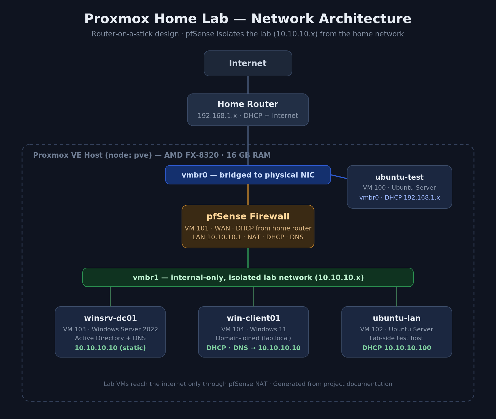
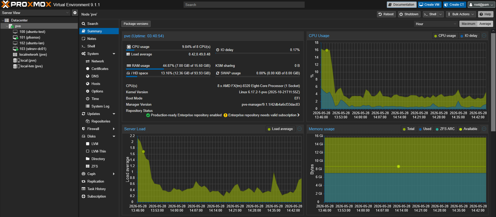
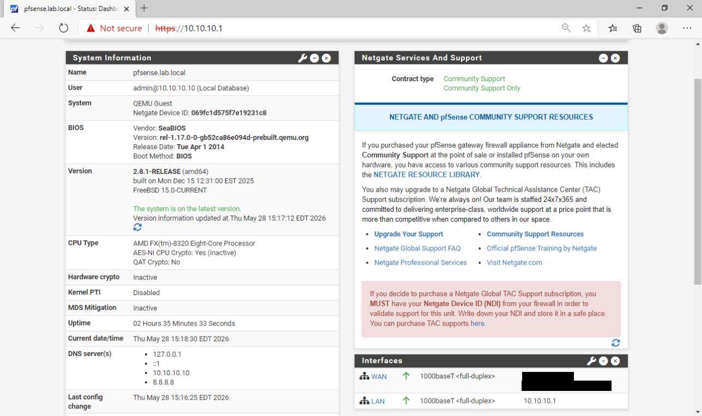
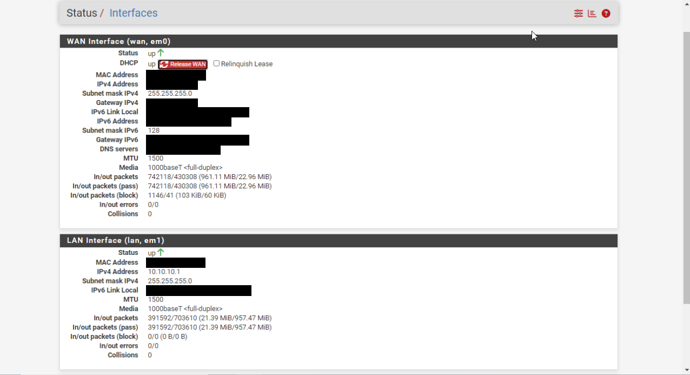
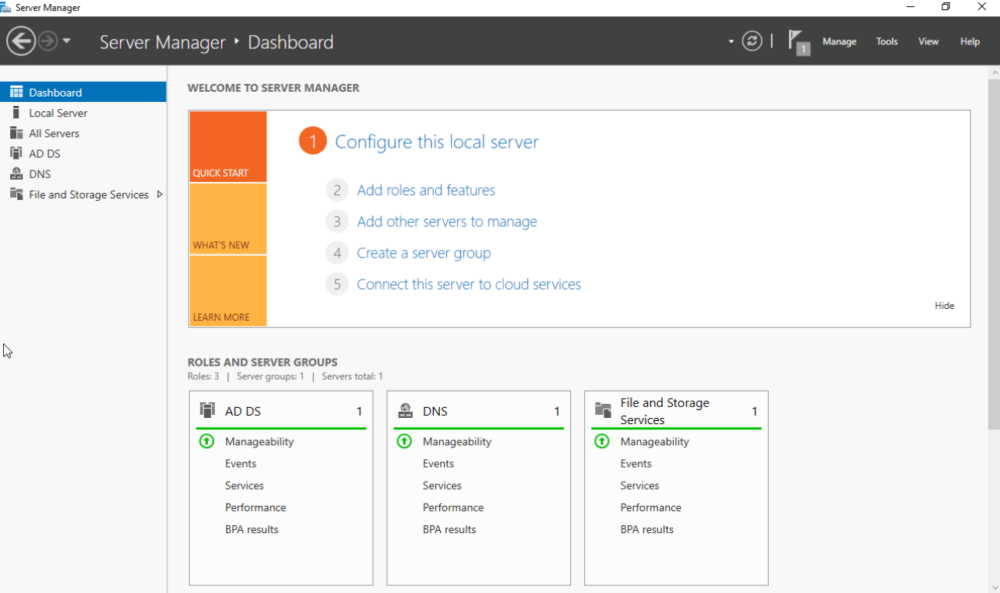
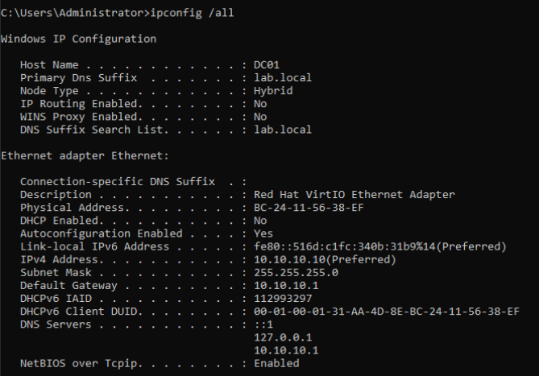
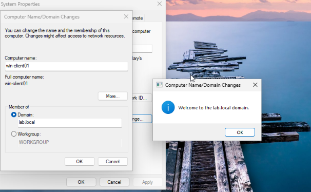
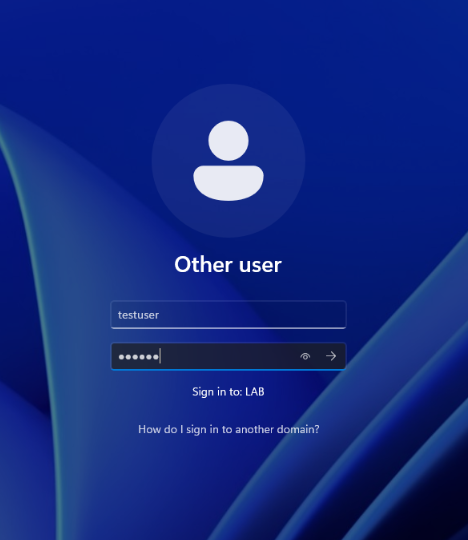
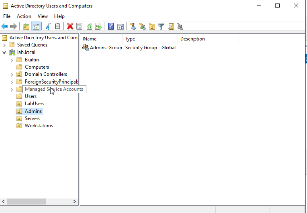
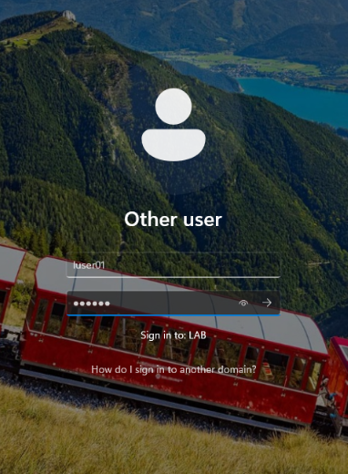

# Proxmox Home Lab

A virtualized enterprise network I built on old hardware to get real hands-on experience with virtualization, firewalls, and Windows Active Directory. The point was to stop reading about this stuff and actually build it, break it, and fix it.

Everything here was set up and tested by me. Where I ran into problems, and there were plenty, I wrote down what went wrong and how I fixed it, because that is the part that taught me the most.

## What I built

Proxmox running bare metal on an old AMD desktop, with an isolated lab network sitting behind a pfSense firewall. Inside that network I built a small Windows environment: a Windows Server 2022 domain controller running Active Directory and DNS, and a Windows 11 client joined to the domain. I finished by setting up organizational units, users, security groups, and a Group Policy that actually changes how the client behaves. Basically a miniature version of a real company network running on one machine in my home.

## Why I did it

Three reasons at once. It backs up my CompTIA studies (A+, Network+, Security+) with practical work instead of just theory. It builds the system administration and networking skills I am after. And it gives me something concrete to point to as I move from IT support toward network engineering and systems administration.

## Hardware

I used gear I already owned on purpose. Part of the point was proving you do not need expensive equipment to build a serious learning environment.

| Component | Detail |
|-----------|--------|
| Machine | AMD FX-8320 eight-core, 16 GB RAM, 1.81 TB drive |
| Hypervisor | Proxmox VE 9.1.1 |
| Management | MacBook Pro M1, used to access Proxmox remotely |
| Secondary | Intel i5-7400 desktop, used only for flashing install media |

One detail that bit me early: AMD virtualization (SVM) was turned off in the BIOS by default. Without it Proxmox cannot run 64-bit VMs with hardware acceleration. I had to enable it under Advanced BIOS Features before anything would start.

## The virtual machines

| ID | Name | OS | Network | Role |
|----|------|----|---------|----|
| 100 | ubuntu-test | Ubuntu Server 24.04 | vmbr0 | First test VM, internet facing |
| 101 | pfsense | pfSense CE 2.8.1 | vmbr0 + vmbr1 | Firewall and router for the lab |
| 102 | ubuntu-lan | Ubuntu Server 24.04 | vmbr1 | Lab-side test VM |
| 103 | winsrv-dc01 | Windows Server 2022 | vmbr1 | Domain controller (AD and DNS) |
| 104 | win-client01 | Windows 11 Enterprise | vmbr1 | Domain-joined client |

## Network design

I wanted the lab completely separated from my home network so nothing I did could touch the rest of the house, and so it would behave like a real corporate segment sitting behind a firewall.

Inside Proxmox I created two virtual bridges. vmbr0 connects to the physical network card, so anything on it gets an address from my home router and has direct internet. vmbr1 is internal only with no physical port at all. That is the isolated lab network on the 10.10.10.x range, and the only way anything on it reaches the internet is through the firewall.

The design is router on a stick. pfSense has one interface on vmbr0 facing the home network (WAN) and one on vmbr1 facing the lab (LAN). It hands out DHCP addresses to the lab, does NAT so lab machines can reach the internet, forwards DNS, and enforces the firewall rules that keep the two networks apart. I chose this over a full edge-firewall setup on purpose. If pfSense breaks, my home network and the rest of the lab keep running, and it is simpler to manage while I am still learning. Moving to a true edge firewall is a later exercise.

## Phase 1: Proxmox

Proxmox VE installed directly on the bare metal of the AMD desktop. This is the layer that lets one physical machine run a bunch of separate VMs from a single web dashboard.

The only real obstacle was the BIOS issue above. My first VM start failed with a KVM virtualization error, and the cause was SVM being disabled. Enabled it, rebooted, and VMs started fine. A good early reminder that the hardware layer matters as much as the software.

## Phase 2: Network and pfSense

With Proxmox running, I built the two bridges and then the pfSense firewall that ties them together.

pfSense runs on FreeBSD, and I found out fast that it does not always play nice with the default Proxmox virtual network card. I switched its NICs to the e1000 type, which got rid of random connection problems. It got two interfaces: the WAN side pulls an address from my home router, and the LAN side I set to a fixed 10.10.10.1, which is the gateway for the whole lab.

To prove the chain worked end to end, I cloned an Ubuntu VM onto the lab network and reached the internet from it. That one successful ping confirmed DHCP, NAT, DNS, and the firewall were all doing their jobs together.

## Phase 3: Windows domain

This is the biggest phase and the one closest to real enterprise work. The goal was to stand up a domain controller, join a Windows 11 client to it, and then manage that client centrally the way an IT department would.

### The domain controller (DC01)

I built the server VM with a modern config on purpose: UEFI firmware and the q35 machine type instead of the legacy options, because that matches how real Windows Server gets deployed today.

Windows Server does not ship with the VirtIO drivers Proxmox uses for fast virtual disks, so during install the disk selection screen showed nothing. I fixed it by attaching the VirtIO driver ISO as a second CD drive and loading the storage driver during setup. The disk appeared and install continued.

After install I renamed the machine to DC01 and gave it a static address of 10.10.10.10. The DNS detail matters here: because the server hosts DNS itself, I pointed its primary DNS at its own loopback (127.0.0.1) and used the firewall as a fallback. Then I installed the Active Directory Domain Services role and promoted it to a domain controller, creating a new forest with the domain lab.local.

Since this is a closed lab and not production, I relaxed the default password policy through Group Policy so I could use simple passwords for testing. That is a trade-off you would never make in production but it is reasonable in a lab.

### The Windows 11 client (win-client01)

This part produced the best troubleshooting of the project.

Windows 11 refused to install on 3 GB of RAM, saying it needs at least 4 GB. Shut the VM down, bumped it to 4 GB, continued. Windows 11 also tries to force a Microsoft account during setup, so I opened a command prompt mid-install and ran `oobe\bypassnro` to create a local account instead.

The real lesson came at the domain join. My first attempt failed with an error that the domain controller could not be contacted, pointing at a missing DNS SRV record (`_ldap._tcp.dc._msdcs.lab.local`). The cause took some thought. The client was using the pfSense firewall as its DNS server, but pfSense does not hold the special Active Directory records a Windows client needs to find a domain controller. Those records only live on the domain controller's own DNS.

The fix was to point the client's DNS straight at the domain controller (10.10.10.10) instead of the firewall. I confirmed with nslookup and ping that DC01 was answering for lab.local, tried the join again, and it worked. After a restart the login screen showed it signing in to the LAB domain, and I logged in with a domain account, which proved the whole authentication chain was working.

### Organizing Active Directory

With the domain working I built a clean structure instead of leaving everything in the default containers. I named things for what they actually are rather than pretending to be a fictional company.

| Organizational Unit | Purpose |
|---------------------|---------|
| LabUsers | Regular domain user accounts |
| Admins | Privileged and admin accounts |
| Servers | Future member servers |
| Workstations | Client computers, including the Windows 11 client |

I created two users (luser01 in LabUsers, ladmin01 in Admins), put each in a matching security group, and moved the client computer object out of the default Computers container into Workstations so it would pick up the right policies. The domain controller itself stays in the built-in Domain Controllers container, which is the correct behavior, so I left it there.

### Group Policy in action

The last step tied it all together. I created a Group Policy Object called Lab-Baseline, linked it to the LabUsers OU, and enabled "Prohibit access to Control Panel and PC settings." On the client I forced a policy refresh, then tried to open Control Panel and got blocked, which is exactly what the policy is supposed to do. A policy report confirmed Lab-Baseline was applied. That is end-to-end proof that a setting I configured on the server reached out and changed the client.

## Problems I solved

Real work is mostly fixing what does not work the first time, so here is the honest list in the order I hit them.

| Problem | Fix |
|---------|-----|
| VMs would not start | SVM virtualization was disabled in BIOS. Enabled it under Advanced BIOS Features. |
| Lab network conflicted with home network | pfSense defaulted its LAN to my home range. Moved the lab to 10.10.10.x during setup. |
| Cloned VMs refused to start | Default Proxmox CPU type is incompatible with my older AMD chip. Set CPU type to host on all VMs. |
| pfSense would not boot after cleanup | I had deleted its installer but the VM still referenced it on a CD drive. Removed the dead drive entry. |
| Windows saw no disk during install | Missing VirtIO storage driver. Loaded it from the driver CD during setup. |
| Windows 11 refused to install | Needs at least 4 GB RAM and I gave it 3. Bumped the memory. |
| Windows 11 forced a Microsoft account | Used `oobe\bypassnro` during setup to create a local account. |
| Client could not join the domain | It used the firewall for DNS, which cannot serve AD records. Pointed DNS straight at the domain controller. |

## What this project demonstrates

Hands-on virtualization with Proxmox and multiple VMs on limited hardware. Network design with an isolated segment, a pfSense firewall, and DHCP, NAT, DNS, and firewall rules. Windows Server and Active Directory: building a domain controller, creating a forest, and managing OUs, users, and groups. Group Policy creation and verification end to end. And troubleshooting real failures across the BIOS, storage, networking, and DNS layers.

## What comes next

The lab is built in phases and I am still growing it. Phase 4 adds a Kali Linux machine and a Wazuh security monitoring system, then scanning the domain controller and practicing contained security testing inside the isolated network. Phase 5 adds a dedicated Linux box for Python scripting to automate routine admin work, plus Ansible for configuration management.

This is ongoing. Every phase starts with a real problem, and the value is in working through it, not just the finished result.
